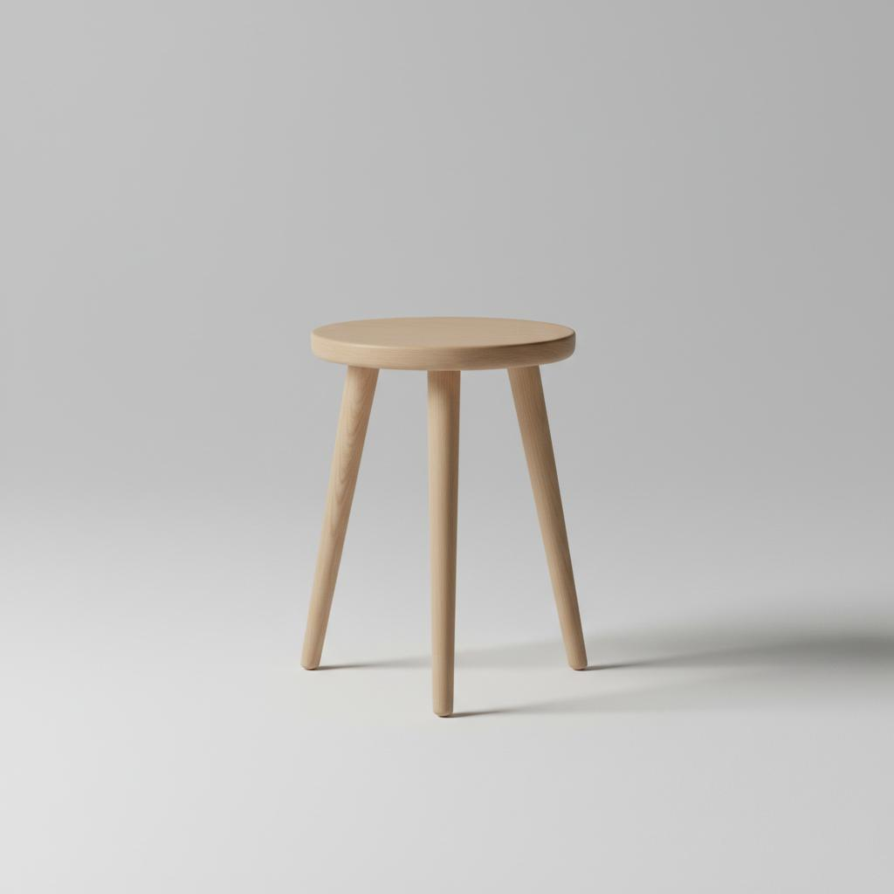

# Sugan - Premium Handcrafted Wooden Furniture



A premium ecommerce website for Sugan, a heritage wooden furniture brand from Jodhpur, India (Since 1999). Built with React, TypeScript, Tailwind CSS, and Vite.

## 🌐 Live Demo

- **Kimi Deploy**: https://2m4yfhl7chwaw.ok.kimi.link
- **GitHub Pages**: [Your GitHub Pages URL after setup]

## ✨ Features

- **Premium Design**: Elegant Scandinavian-inspired aesthetic with warm wood tones
- **Smooth Animations**: GSAP-powered scroll animations and transitions
- **Product Catalog**: 7 handcrafted wooden lifestyle products
- **Shopping Cart**: Full cart functionality with Amazon checkout integration
- **Responsive**: Mobile-first design that works on all devices
- **Fast Performance**: Optimized build with Vite

## 🛠️ Tech Stack

- **Framework**: React 18 + TypeScript
- **Build Tool**: Vite
- **Styling**: Tailwind CSS
- **Animations**: GSAP + ScrollTrigger
- **Icons**: Lucide React
- **UI Components**: shadcn/ui

## 🚀 Getting Started

### Prerequisites

- Node.js 20+
- npm or yarn

### Installation

1. Clone the repository:
```bash
git clone https://github.com/YOUR_USERNAME/sugan-website.git
cd sugan-website
```

2. Install dependencies:
```bash
npm install
```

3. Start development server:
```bash
npm run dev
```

4. Open http://localhost:5173 in your browser

### Build for Production

```bash
npm run build
```

The built files will be in the `dist/` directory.

## 📁 Project Structure

```
sugan-website/
├── .github/workflows/    # GitHub Actions for deployment
├── public/
│   └── images/           # Product and hero images
├── src/
│   ├── components/ui/    # shadcn/ui components
│   ├── context/          # React context (Cart)
│   ├── data/             # Product data
│   ├── sections/         # Page sections
│   ├── types/            # TypeScript types
│   ├── App.tsx           # Main app component
│   └── index.css         # Global styles
├── index.html
├── package.json
├── tailwind.config.js
├── tsconfig.json
└── vite.config.ts
```

## 🛒 Amazon Integration

### Current Setup
Products are configured with placeholder Amazon URLs. To connect your actual Amazon listings:

1. Edit `src/data/products.ts`
2. Update the `amazonUrl` field for each product with your actual Amazon product URLs
3. Update the `asin` field with your product ASINs

### Amazon SP-API (Optional)
For automated product sync, you'll need:
- Amazon Seller Central Developer account
- AWS IAM credentials
- SP-API access tokens

## 🚀 Deployment

### GitHub Pages (Recommended)

1. Push to GitHub:
```bash
git remote add origin https://github.com/YOUR_USERNAME/sugan-website.git
git push -u origin main
```

2. Enable GitHub Pages:
   - Go to repository Settings → Pages
   - Source: GitHub Actions

3. The site will automatically deploy on every push to `main`

### Manual Deployment

Build the project and deploy the `dist/` folder to any static hosting service:
- Netlify
- Vercel
- Firebase Hosting
- AWS S3

## 📝 Customization

### Colors
Edit `tailwind.config.js` to change brand colors:
```javascript
colors: {
  sugan: {
    gold: "#D4A056",
    brown: "#2C1810",
    cream: "#F5F0E8",
  }
}
```

### Products
Edit `src/data/products.ts` to add/modify products.

### Images
Replace images in `public/images/` with your own product photos.

## 📄 License

MIT License - feel free to use this template for your own projects.

## 🤝 Credits

- Design & Development: Kimi AI
- Images: AI-generated with premium prompts
- Icons: [Lucide](https://lucide.dev)
- Fonts: Google Fonts (Cormorant Garamond, Inter)

---

Made with ❤️ in Jodhpur, India
